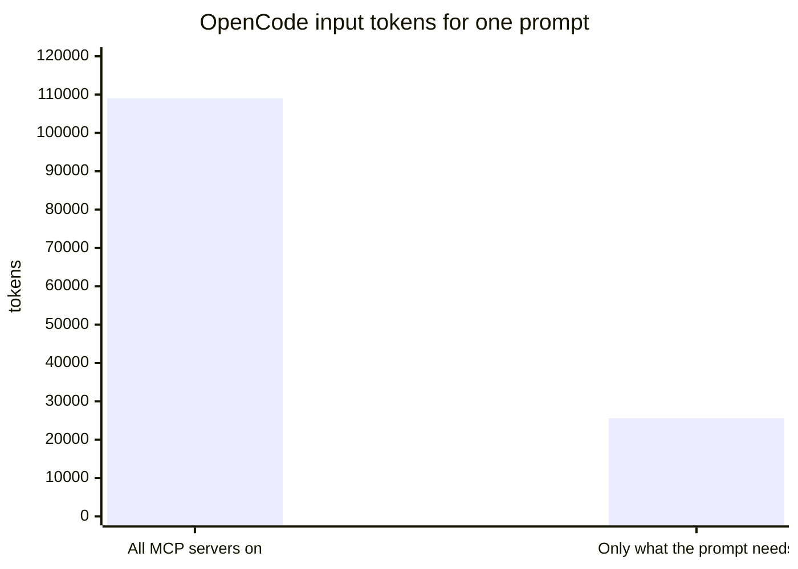
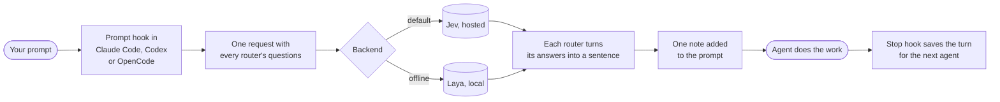

# jev-router

jev-router reads each prompt before your coding agent does and decides what that prompt needs:
which skills to load, which tools and MCP servers to use, which model and effort level to run
on, and which earlier work from another agent to pass along. It runs as hooks inside
[Claude Code](https://claude.com/claude-code), [Codex](https://github.com/openai/codex) and
[OpenCode](https://opencode.ai), plus a `jev` command that starts the right one.

The decisions come from [Jev](https://docs.typesafe.ai), TypeSafe's classifier model, or from
[Laya](https://huggingface.co/convaiinnovations/laya), an open model with the same API that runs
on your own machine.

## In plain words

A coding agent starts every session carrying everything it might need: instructions for 140
skills, every tool from every connected service, the most expensive model. Most prompts need a
small slice of that. Carrying the rest costs money and leaves less room for your code.

jev-router works like a good assistant at a front desk. It reads your request, pulls the two
folders that matter, tells the agent which rooms it will not need, and says whether this is a
job for the senior engineer or a quick one. When you move from one agent to another, it passes
along a short note of what the last one did, so you do not have to explain again.

## What it saves

Measured on the author's laptop on 2026-09-23.

| Where | Before | After | Why |
| --- | --- | --- | --- |
| Claude Code, context used at session start | 7% of a 1M window | 2%, 15.4k tokens | Skills hidden until needed, unused plugins off |
| OpenCode, input tokens for a one-word prompt | 109,069 | 25,585 | Launched with only the MCP servers the prompt needs |
| A small question on Codex | GPT-6 Sol at xhigh effort | GPT-6 Luna at low effort | Model router picked the cheapest tier that fits |



The router's own cost is one Jev request per prompt, about 7.5k Jev tokens and 0.5 to 0.75 s,
none of it in your agent's context beyond a one-line note.

## Jev or Laya

Both answer the same typed questions ("does this prompt change code?", "how hard is it, 0 to 4?")
with probabilities. Neither writes text.

| | Jev | Laya |
| --- | --- | --- |
| What it is | TypeSafe's hosted System One model | Open-weight model with the same API, Apache 2.0 |
| Runs | api.typesafe.ai, needs `TYPESAFE_API_KEY` | Your machine, no key, about 800 MB download |
| Yes/no accuracy on the 20-prompt set | 99% | 89% |
| Model tier exactly right | 18 of 20 | 11 of 20 |
| Median latency | 511 ms | 815 ms on CPU |
| Can pick among 140 skills | Yes | No, it degrades past about 20 options |

Default is `auto`: Jev first, Laya when Jev is unreachable. Switch in any session with
`jev backend jev`, `jev backend laya` or `jev backend auto`. Laya is good enough to keep routing
going offline. It is not yet good enough to choose models: its effort ratings bunch between 1.4
and 2.3 for everything, so when Laya answers, the model router only suggests. Whether Laya needs training for this
work, and what it would take: [docs/backends.md](docs/backends.md#does-laya-need-training-for-this-work).

## Install

### What you need

| Need | Why | Check |
| --- | --- | --- |
| macOS or Linux | The hooks are shell commands | |
| Python 3.11 or newer | The router is plain Python, no packages | `python3 --version` |
| At least one of Claude Code, Codex, OpenCode | The agents it routes for | `claude --version`, `codex --version`, `opencode --version` |
| A TypeSafe API key | Jev answers the routing questions. See [docs.typesafe.ai](https://docs.typesafe.ai) | `echo $TYPESAFE_API_KEY` |
| Git | Clone the repo, and the handover reads `git status` | `git --version` |

Laya, Potpie, graphify and GSD are optional.

### Steps

1. **Put your key where your agents can see it.** Add it to your shell profile for terminal use.
   On macOS, also run `launchctl setenv` so desktop apps get it:

   ```sh
   echo 'export TYPESAFE_API_KEY=your-key' >> ~/.zshrc
   launchctl setenv TYPESAFE_API_KEY your-key   # macOS only
   ```

2. **Clone and test.** The tests run offline in about a second.

   ```sh
   git clone https://github.com/0xSarnavo/jev-router ~/jev-router
   cd ~/jev-router
   python3 -m unittest discover -s tests
   ```

3. **Install.** This backs up every file it edits, then wires in each CLI it finds.

   ```sh
   python3 install.py
   ```

   | CLI | What it adds |
   | --- | --- |
   | Claude Code | `SessionStart`, `UserPromptSubmit` and `Stop` hooks. Hides your skills from the startup list, and their slash commands still work |
   | Codex | The same hooks in `~/.codex/hooks.json` |
   | OpenCode | A plugin at `~/.config/opencode/plugins/jev-router.js` |
   | Your shell | The `jev` launcher at `~/.local/bin/jev` |

4. **Codex only: trust the hooks once.** Start `codex`. It shows "Hooks need review". Choose to
   trust them.

5. **Check it works.** Start a new session in any of the three CLIs and type `jev status`. You
   should see the mode and routers. In Claude Code and Codex the command never reaches the
   model. OpenCode plugins cannot block a prompt, so there the agent relays the status. Then try the
   launcher without starting anything:

   ```sh
   jev --dry "fix the typo in the footer"
   ```

6. **Optional: Laya as an offline fallback.** Follow
   [docs/backends.md](docs/backends.md#running-laya). About 800 MB.

To undo everything: `python3 install.py --uninstall`.

### Troubleshooting

| Symptom | Cause and fix |
| --- | --- |
| No `[jev-router]` notes appear | The session started before install, or the key is missing in that app. Start a new session. Check `~/.cache/jev-router/log.jsonl` for `"event": "error"` lines |
| "Router unavailable" note | Jev could not be reached and Laya is not running. Routing is skipped, and the prompt still goes through |
| Codex ignores the router | The hooks were not trusted. Restart Codex and trust them |
| OpenCode turns filed under the wrong project | OpenCode reads its folder from `$PWD`. Start it from a shell in the project, or with `jev` |
| `jev: command not found` | `~/.local/bin` is not on your `PATH` |

## When you add something new

The router discovers most things by itself. This is what to do for the rest:

| You add | Do this |
| --- | --- |
| A skill in `~/.claude/skills` | Nothing for routing, the catalog rebuilds when a `SKILL.md` changes. Rerun `python3 install.py` to hide it from the startup list |
| An MCP server | It is found automatically. Add one line to `mcp.describe` in `config.local.json` saying what it is for, or Jev only sees its name |
| A skill that should always load | Add it to `skills.always_on` and rerun `install.py` |
| A skill that fits a kind of work, not a topic | Add a yes/no question to `skills.gated`, then rerun `python3 bench/backends.py` |
| A new model release | Edit `models.tiers` and `models.rank`. Check effort advice before raising a tier |
| A new agent CLI | It needs a prompt hook or plugin that can add context. See [docs/model-router.md](docs/model-router.md#what-each-cli-allows) for what the current three allow |
| A new version of Claude Code, Codex or OpenCode | Run `python3 bench/handover.py` to confirm handovers still pass |

## Use it

Work as usual. Each prompt gets one note the agent follows, for example:

```
[jev-router] Load skill `ponytail`: read ~/.claude/skills/ponytail/SKILL.md and follow it for
this task. Tools not needed, skip them: web, browser. MCP servers not needed, do not search or
call their tools: railway, tinyfish. Model: Jev rates this small (effort 0.9/4). Before
starting, ask the user with AskUserQuestion ...
```

To start a task in the best agent, use the launcher:

```
$ jev "our checkout sometimes double charges customers, find out why and fix it"
Jev: large task, effort 2.97/4 (642 ms).
  1. claude: opus at medium effort (recommended). MCP: railway, tinyfish, drops logos-copilot, figma
  2. codex: gpt-6-sol at max effort. MCP: railway, node_repl
  3. opencode: opencode/muse-spark-1.3-contributor-free. MCP: railway, tinyfish, drops figma, higgsfield
Pick 1-3 [1], or q to quit:
```

Type these as a prompt in any session. They never reach the model:

| Prompt | Effect for this session |
| --- | --- |
| `jev smart` | Default. Skip short replies like `ok`, route the rest |
| `jev all`, `jev ask`, `jev off` | Route everything, only prompts starting `jev:`, or nothing |
| `jev skills off` (or `tools`, `mcp`, `models`, `context`) | Switch one router off. `on` turns it back on |
| `jev model suggest`, `ask`, `auto`, `off` | How the model router acts. Default `ask` |
| `jev backend jev`, `laya`, `auto` | Which service answers |
| `jev status` | Show the current settings |

## How it works



| Router | Decides | Doc |
| --- | --- | --- |
| Skills | Which skill files to read. Three are gated on the kind of work: ponytail for code changes, no-ai-slop for prose, potpie-cli for project history | [skill-router.md](docs/skill-router.md) |
| Tools | Which built-in tool groups to use or skip | [tool-router.md](docs/tool-router.md) |
| MCP | Which MCP servers the prompt needs. A hint in session, a real cut at launch | [mcp-router.md](docs/mcp-router.md) |
| Models | Tier and effort. Suggests, asks with a picker, or hands work to a cheaper subagent. Quiet in long sessions, where switching would throw away the cache | [model-router.md](docs/model-router.md) |
| Context | Which earlier turns, from any CLI, the next agent should see | [context-router.md](docs/context-router.md) |

When you switch agents, nothing is pushed wholesale. Each turn is saved as a few lines. The next
agent gets only the turns Jev judges relevant, capped at 1,800 characters, plus the earlier
transcript path if it needs more.

## Benchmarks

Everything below is reproducible with the scripts in `bench/`.

**Backends** (`python3 bench/backends.py`). 20 prompts labelled by hand, from "thanks, that
worked" to "redesign the whole auth architecture". Each backend answered five yes/no questions
and the three model-tier questions per prompt.

| Question | Jev | Laya |
| --- | --- | --- |
| Will this change code? | 100% | 85% |
| Is this prose for people to read? | 95% | 85% |
| Does it need recorded project history? | 100% | 95% |
| Does it need the Railway MCP server? | 100% | 95% |
| Does it need web search? | 100% | 85% |
| Model tier exact | 90% | 55% |
| Model tier within one step | 90% | 100% |

Jev's two tier misses: an explanation of the payment webhook flow was bumped to large because
the word payment counts as risk, and a competitor research task was rated open-ended research.
Laya lands within one step every time because it rates nearly everything as standard.

**Handover across CLIs** (`python3 bench/handover.py`). Agent A is told a release codename in a
fresh repo. Agent B, a different CLI, is asked for it without reading files.

| From \ To | Claude Code | Codex | OpenCode |
| --- | --- | --- | --- |
| Claude Code (haiku) | n/a | Pass, 12.4 s | Pass, 21.4 s |
| Codex (gpt-6-luna, low) | Pass, 8.7 s | n/a | Pass, 14.5 s |
| OpenCode (Muse Spark, free) | Pass, 8.5 s | Pass, 12.4 s | n/a |

6 of 6 directions passed. The time is how long the second agent took to answer. Without the handover the second agent has no way to know the codename: it is in no file.

**This README** (`python3 bench/readme_check.py`). Jev and Laya each judged whether this file
covers the 15 points it is meant to cover, from "explains what it is in plain words" to "says
what data leaves the machine". Jev rated all 15 as covered, between 0.94 and 0.99. Laya rated 4
below 0.6, mostly because it reads only about 320 tokens of a 2,000-word file. Full table in
[bench/README.md](bench/README.md).

## FAQ

**Does it work with a subscription, or only with API keys?** Both. The router runs inside each CLI
and does not care how the CLI signs in. Everything in this README was tested with Claude Code on
a claude.ai subscription, Codex signed in with ChatGPT, and OpenCode with no account on its free
models. The only key it needs is `TYPESAFE_API_KEY` for Jev, which is a separate service, and
Laya needs no key at all. On a subscription the savings show up as usage limits rather than
money, where plans count heavier models against those limits faster.

**Can I get the same skills and tools?** Most of them. [docs/oss.md](docs/oss.md) lists where
each skill comes from, its license and the install command. 125 of the 143 skills on the
author's machine come from repos with an open-source license. `npx skills add <repo> -g -a '*'`
installs a skill for Claude Code, Codex and OpenCode at once.

**Is there a better local option than stock Laya?** Yes, as an alternative:
[laya-coding-router](https://github.com/0xSarnavo/laya-coding-router) is Laya fine-tuned for these
questions, with the same API. It is still training. See
[docs/backends.md](docs/backends.md#alternative-laya-coding-router).

## Privacy

Routed prompt text, the project folder name, MCP server names and short excerpts of earlier
turns go to the TypeSafe API when Jev answers. With Laya, nothing leaves the machine. Use
`jev off` or `jev backend laya` in sessions where that matters. Logs in `~/.cache/jev-router/`
store decisions and a hash of each prompt, not prompt text. The handoff log stores turn excerpts
and stays local.

## Contributing

This repo is built with its own router switched on. While working on it, the hooks load
ponytail for code changes and no-ai-slop for docs, and the handover passes work between Claude
Code, Codex and OpenCode. Three other tools hold the project's memory, and each has one job:

| Tool | Its job here | How to use it in this repo |
| --- | --- | --- |
| Potpie | Why things are the way they are: decisions, features, past bugs | Pot `jev-router`. `potpie --json graph search-entities "why does auto fall back to Laya" --limit 3` |
| graphify | What calls what, and what a change touches | `graphify update .` builds the graph in 2.5 s. `graphify explain on_prompt --graph .planning/graphs/graph.json` lists callers and callees |
| GSD | Plans, progress and pause-and-resume handoffs | Files under `.planning/`. `/gsd-pause-work` before you stop, `/gsd-resume-work` to continue |

Use `graphify explain` or `graphify path` for code questions, never a full graph dump: one
`gsd-tools graphify query` returned 149 KB. [docs/stack-plan.md](docs/stack-plan.md) covers how
the four fit together and what is planned.

To change the router:

1. Run `python3 -m unittest discover -s tests`. It runs offline in about a second.
2. A new router is a module with `questions(cfg, ctx)` and `route(cfg, answers, session, ctx)`,
   added to `ROUTERS` in `router.py`, with its own section in `config.json` and a doc in `docs/`.
3. If you change a question's wording, rerun `python3 bench/backends.py` and put the numbers in
   your pull request. Question wording moves accuracy more than thresholds do: rewording the
   potpie gate took a navbar bug fix from 0.80 to 0.03 while keeping 0.97 on a real history
   question.
4. Keep the router's notes to one line of pointers. Anything that loads content into every
   prompt needs a measurement showing it pays for itself.

## Files

| Path | Role |
| --- | --- |
| `router.py` | Hook entry point: modes, the backend call, logging |
| `skills.py`, `tools.py`, `mcps.py`, `models.py`, `context.py` | The five routers |
| `jev.py` | Client for Jev and Laya, never logs the key |
| `launch.py` | The `jev` launcher |
| `install.py` | Adds and removes hooks for all three CLIs |
| `opencode/jev-router.js` | OpenCode plugin template |
| `config.json` | Defaults. Put your changes in `config.local.json` |
| `bench/` | Benchmarks and their latest results |
| `docs/` | One doc per router, backends, and the stack plan |
